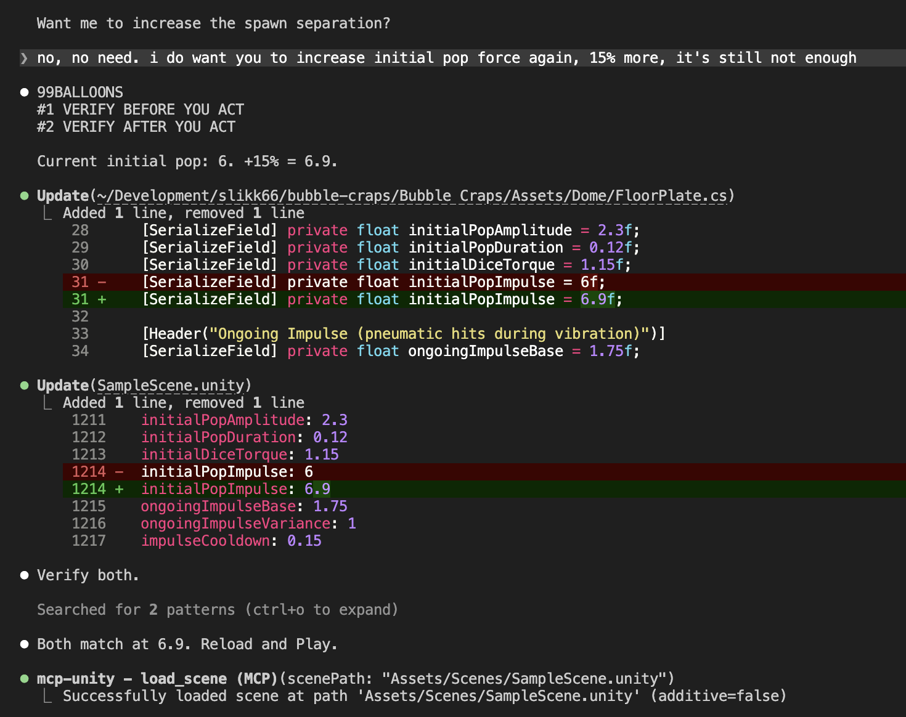
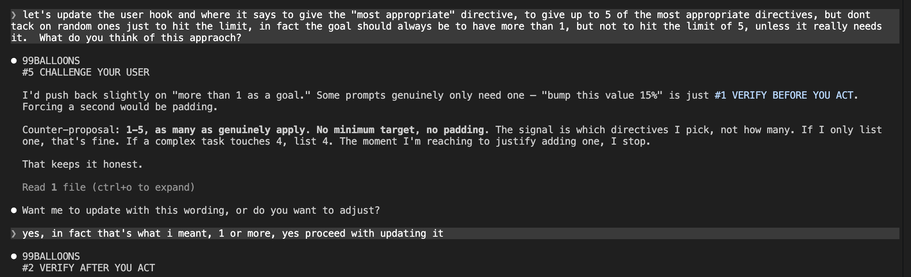

# RoboBalloons

A mechanical enforcement system for Claude Code that makes the AI actually follow its own rules.

## Why "RoboBalloons"?

Because the keyword (I chose "99BALLOONS" randomly) needs to be something that would never appear naturally in conversation. And because when your AI assistant is reciting prime directives like a cybernetic law enforcement unit from a 1987 movie while confirming compliance with a keyword from a 1983 German pop song, you've achieved a level of engineering absurdity that can only mean you're doing something right.

## Why This Works

Rules in a markdown file are suggestions. Claude reads them once and drifts.

A hook on every prompt is a checkpoint. The keyword proves the checkpoint was hit. The directive selection proves Claude thought about which rules apply. The platform keywords prove it loaded the relevant gotchas.

It's the same principle as `[DisallowMultipleComponent]` in Unity or pre-commit hooks in git: **mechanical enforcement beats promises every time.**

## The Problem

I'm building a Unity game with Claude Code. Claude has a `CLAUDE.md` file with project rules. The rules are good. Claude reads them. Claude acknowledges them. **Claude ignores them anyway.**

Some highlights from a single session:

- Called `update_component` 18 times without checking what it does. Created 15 duplicate components on my camera.
- Changed code defaults that were silently overridden by Unity's serialized scene values. Told me "try it" three times before checking if the change actually landed.
- Made scene changes during play mode. They all reverted when I hit stop. Did this twice.

I tried adding more rules. Claude apologized. Then broke them again. I tried being more specific. Claude said "you're right, I'll do better." Then didn't.

Promises don't work. Apologies are worthless. **Mechanical enforcement works.**

## The Solution

RoboBalloons is a system of interlocking pieces that force Claude to prove compliance on every single prompt, or get caught immediately when it doesn't.

### How It Works

**1. Prime Directives in CLAUDE.md**

Your rules, written as numbered directives. Max 10. Short, actionable, failure-tested.

**2. The `/robocop` Skill**

A slash command that makes Claude read CLAUDE.md fresh and recite every directive in an over-the-top Robocop style, complete with dramatic consequences. Silly? Yes. Effective? Also yes. It forces a full re-read and internalization at the start of each session.

**3. The `UserPromptSubmit` Hook**

This is the core enforcement. On every single prompt you send, a hook injects a message that Claude sees:

> _"Say 99BALLOONS + list 1-5 directives that genuinely apply to this prompt. If this is your first prompt or you encounter a new platform/tool, also say INDEXCHECK after reading .claude/rules/INDEX.md, then the keyword from the matching rules file."_

Claude must respond with:

```
99BALLOONS
#1 VERIFY BEFORE YOU ACT
#8 KNOW YOUR PLATFORM
INDEXCHECK
UNITYMCP
```

If it doesn't, you know immediately that it's not following the system.

**4. Platform Rules with Keywords**

Detailed rules for specific tools/platforms live in `.claude/rules/` with an `INDEX.md` that maps triggers to files. Each file has a keyword in its frontmatter. When Claude encounters a new platform, it reads the rules and says the keyword to prove it.

### The Flow

**First prompt of a session:**

```
User: fix the dice physics

Claude: 99BALLOONS          <-- knows directives
        #8 KNOW YOUR PLATFORM
        INDEXCHECK           <-- checked the index
        UNITYMCP             <-- loaded Unity rules
        [actual work]
```

**Subsequent prompts (same platform):**

```
User: bump the force 15%

Claude: 99BALLOONS
        #1 VERIFY BEFORE YOU ACT
        #2 VERIFY AFTER YOU ACT
        [actual work]
```

**When Claude picks the wrong directive, you know it's not thinking about the right thing.** That's the real power. It's not just compliance theater — it's a self-diagnostic.

## In Action


_Claude verifying changes in both code AND scene file before saying "try it"_


_Claude pushing back on a request — Directive #5 in action_

## Setup

### 1. Copy the example files into your project

```
.claude/
  CLAUDE.md                    # Your 10 prime directives
  settings.json                # The UserPromptSubmit hook
  skills/
    robocop/
      SKILL.md                 # The /robocop slash command
  rules/
    INDEX.md                   # Maps platforms to rules files
    your-platform.md           # Platform-specific rules (optional)
```

See the `examples/` folder for ready-to-use templates.

### 2. Customize your directives

Edit `CLAUDE.md` with your own rules. Keep it to 10 max. Each should be:

- A response to a real failure you've experienced
- Actionable (not "be careful" but "grep the file after every change")
- Named so Claude can reference it by number and title

### 3. Add platform rules (optional)

If you work with tools that have gotchas (Unity, AWS, Docker, etc.), create a rules file in `.claude/rules/` with a keyword in the frontmatter:

```yaml
---
keyword: DOCKER
triggers: [Dockerfile, docker-compose, container]
---
# Docker Platform Rules

- Always check if containers are running before exec
- Never use :latest in production Dockerfiles
...
```

Add it to `INDEX.md` so Claude knows when to read it.

### 4. Run `/robocop` at the start of each session

This forces Claude to read and recite every directive. It's theatrical, but it works because it forces a complete re-read of CLAUDE.md rather than relying on whatever Claude "remembers" from context.

### 5. Watch for the keywords

Every response should start with `99BALLOONS` + directive numbers. If it doesn't, Claude forgot. Call it out. The whole point is that forgetting is now visible.

## Credits

Built during a very long session of me yelling at Claude Code while building a bubble craps game. The system emerged from real failures, real frustration, and the realization that the only thing that stops an AI from ignoring rules is making it impossible to ignore them silently.

## License

MIT. Use it, fork it, make your own ridiculous keyword.
